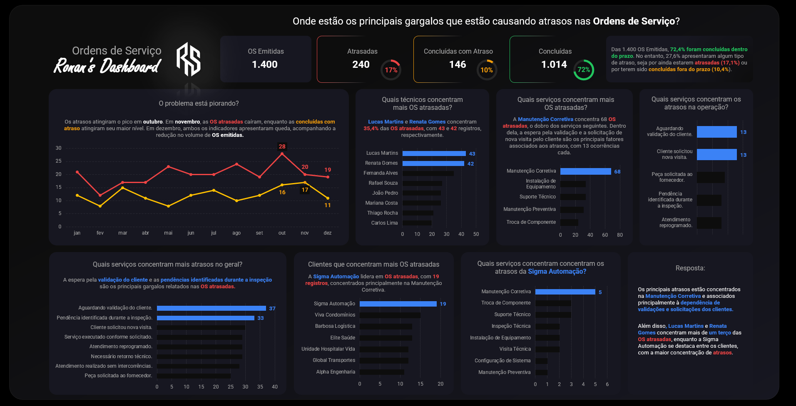
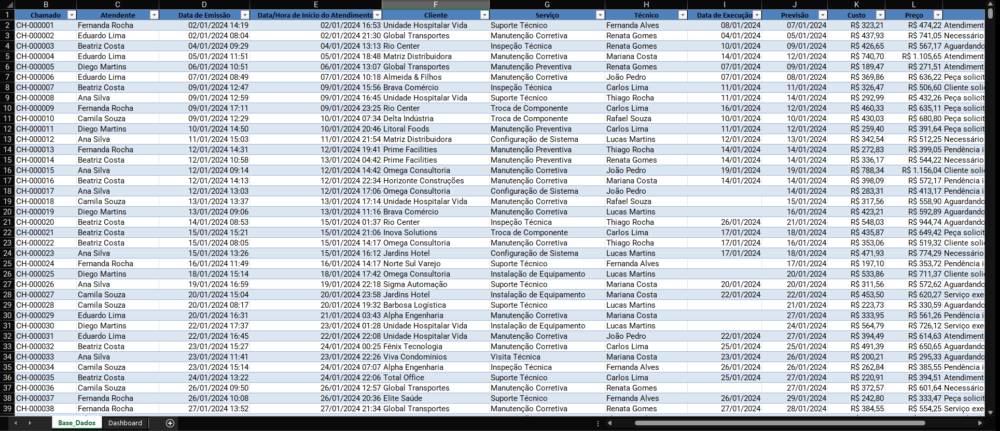
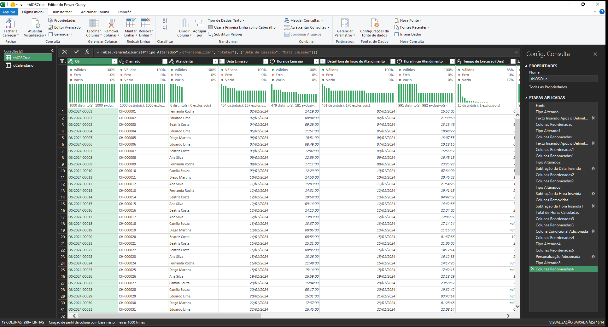
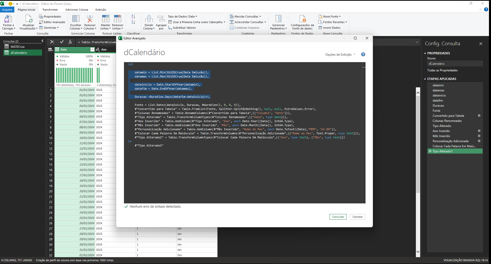
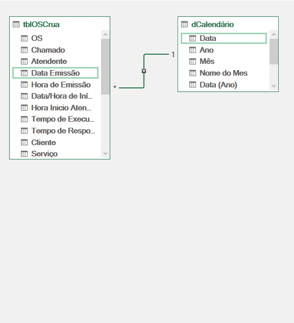
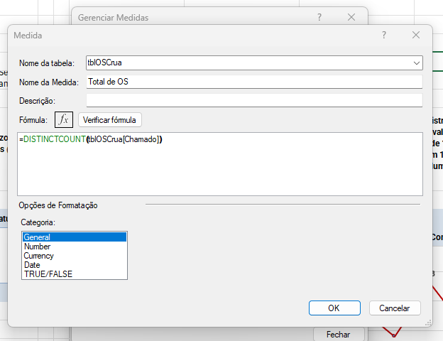
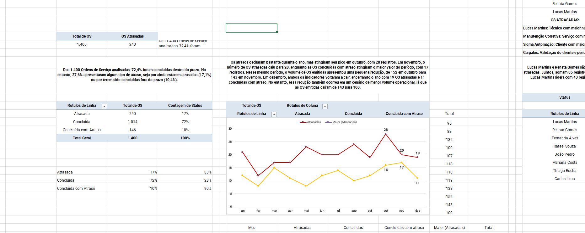

# Dashboard de Ordens de Serviço — Excel

Dashboard desenvolvido no Microsoft Excel para acompanhamento e análise de **Ordens de Serviço (OS)**, com foco na identificação de gargalos operacionais e causas relacionadas aos atrasos.

---

## 1. Preview



---

## 2. Overview

Projeto desenvolvido para transformar uma base de Ordens de Serviço em uma solução de acompanhamento e diagnóstico operacional.

O dashboard integra **Power Query, Power Pivot e DAX** para preparação, modelagem e análise dos dados.

A construção foi orientada por princípios de **Data Storytelling e UI/UX**, organizando os indicadores em uma sequência lógica de análise.

A narrativa parte de uma visão geral das OS e conduz o usuário até a identificação dos principais responsáveis, serviços, causas e concentrações de atrasos.

---

## 3. Dados

### Base de Dados

A base contém os registros das Ordens de Serviço utilizados para alimentar o modelo analítico.

Os dados servem como ponto de partida para as etapas de tratamento, modelagem e construção dos indicadores.



### Tratamento dos Dados

O **Power Query** foi utilizado para preparar a base antes de sua utilização no modelo.

Foram realizadas transformações, padronizações e criação de informações derivadas necessárias para as análises.



---

## 4. Tabela dCalendário

Foi criada uma tabela `dCalendário` diretamente no **Power Query** para estruturar as análises temporais.

A dimensão contém campos como:

- Data
- Ano
- Mês

A tabela é utilizada como dimensão de tempo no modelo e permite analisar a evolução das Ordens de Serviço ao longo dos períodos.



---

## 5. Modelagem de Dados — Power Pivot

As tabelas utilizadas no projeto foram adicionadas ao **Modelo de Dados do Excel** e conectadas por meio de relacionamentos no Power Pivot.

Essa estrutura permite integrar as informações das Ordens de Serviço à dimensão de calendário e utilizar o modelo como base para as análises.



---

## 6. Medidas DAX

Foram desenvolvidas medidas em **DAX** para calcular os principais indicadores utilizados no dashboard.

As medidas permitem manter os cálculos dinâmicos conforme os filtros aplicados e estruturar os indicadores utilizados na análise operacional.



---

## 7. Tabelas Dinâmicas

As **Tabelas Dinâmicas** foram utilizadas para estruturar as análises e alimentar os componentes visuais do dashboard.

A partir do modelo de dados e das medidas criadas, foram organizadas as informações necessárias para acompanhar a evolução das OS e investigar os principais pontos de atenção.



---

## 8. Storytelling Analítico

O dashboard foi estruturado para responder progressivamente à pergunta central:

> **Onde estão os principais gargalos que estão causando atrasos nas Ordens de Serviço?**

A análise segue uma sequência que parte do panorama geral e avança para o diagnóstico:

```text
Visão Geral
     ↓
Evolução dos atrasos
     ↓
Responsáveis
     ↓
Tipos de serviço
     ↓
Causas dos atrasos
     ↓
Clientes
     ↓
Diagnóstico final

Essa estrutura permite sair de uma visão descritiva dos indicadores e avançar para a identificação dos principais pontos de concentração dos atraso

## 9. Arquitetura da Solução
